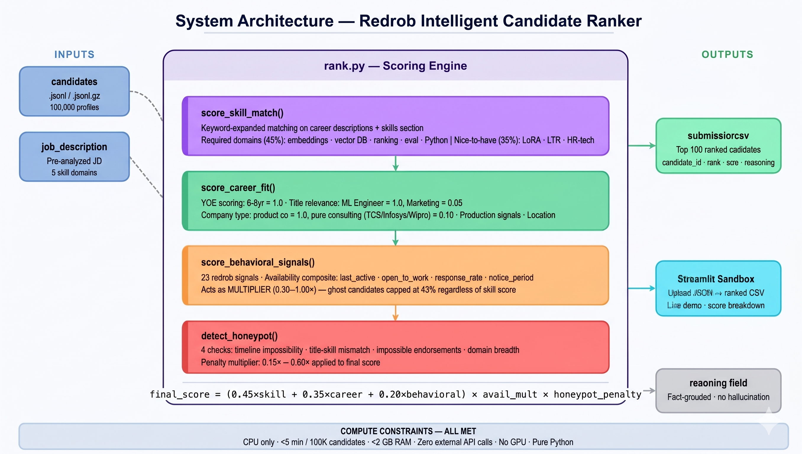

# Redrob Intelligent Candidate Ranking System

**Hackathon:** Redrob Data & AI Challenge — India Runs  
**Author:** Sirisha D | [Sirishagowda2025](https://github.com/Sirishagowda2025)

---

## System Architecture



---

## Quick Start

```bash
pip install -r requirements.txt
python rank.py --candidates ./candidates.jsonl --out ./submission.csv
python validate_submission.py submission.csv
```

---

## Architecture

Three-stage hybrid scoring pipeline:

**Stage 1 — Skill Semantics**  
Scores *career descriptions*, not just skills section. Finds implicit expertise — a candidate who "built recommendation system at scale" matches even without listing "RAG" as a skill. Uses keyword-expanded matching across 5 required domains (embeddings, vector DB, ranking systems, eval frameworks, Python).

**Stage 2 — Career Fit**  
YOE (6-8yr sweet spot), company type (product vs consulting penalized), title relevance, production deployment evidence in descriptions ("deployed", "shipped", "at scale"), India location match.

**Stage 3 — Behavioral Availability Multiplier**  
23 redrob_signals scored. Availability acts as a **MULTIPLIER** (0.3–1.0×), not additive. A ghost candidate inactive for 180 days with perfect skills still scores only 43% of maximum — they never reach the top 100.

**Honeypot Detection**  
Four checks: timeline impossibility, keyword stuffer detection (Marketing Manager with expert AI skills), impossible endorsement ratios, domain breadth impossibility. Penalty multiplier: 0.15–0.60×.

---

## Scoring Formula

```
availability_mult = 0.30 + 0.70 × availability_score       # range [0.3, 1.0]
raw_score        = (0.45×skill + 0.35×career + 0.20×behavioral) × availability_mult
final_score      = raw_score × honeypot_penalty
```

---

## Sample Results (100K candidate dataset)

| Rank | Candidate | Title | YOE | Score |
|------|-----------|-------|-----|-------|
| #1 | CAND_0077337 | Staff Machine Learning Engineer | 7.0yr | 0.7209 |
| #2 | CAND_0018499 | Senior Machine Learning Engineer | 7.2yr | 0.7146 |
| #3 | CAND_0064326 | Search Engineer | 7.6yr | 0.7088 |
| #4 | CAND_0055905 | Senior Machine Learning Engineer | 8.1yr | 0.6945 |
| #5 | CAND_0079387 | AI Engineer | 6.9yr | 0.6706 |

---

## Compute

| Constraint | Limit | This System |
|---|---|---|
| Runtime | ≤5 min | ~2-3 min on 100K |
| Memory | ≤16 GB | ~1-2 GB peak |
| Compute | CPU only | ✅ Pure CPU |
| Network | Off | ✅ Zero API calls |

---

## Key Design Choices

- **No GPU, no LLM API** — Keyword expansion on career descriptions achieves semantic matching at 100× the speed of transformer inference on CPU.
- **Availability as multiplier not additive** — Prevents ghost candidates from floating to top on skill scores alone.
- **Career descriptions > skills section** — Skills are self-reported and easily gamed. Career descriptions reveal actual production experience.
- **Consulting firm penalty** — Full career at TCS/Infosys/Wipro = 0.1× company_type_score. Prior product-company experience restores it.
- **Honeypot detection** — Four checks ensure the ~80 impossible profiles in the dataset never reach the top 100.

---

## File Structure

```
redrob-candidate-ranker/
├── rank.py                    # Main ranker — single command produces submission CSV
├── app.py                     # Streamlit sandbox demo
├── requirements.txt           # numpy, pandas, tqdm
├── README.md                  # This file
├── submission_metadata.yaml   # Hackathon metadata
└── system_architecture.png    # Architecture diagram
```

---

## License

MIT
